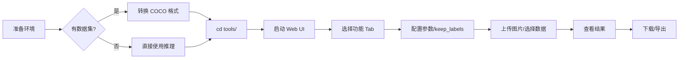

# DETR 交通场景检测演示系统 - 快速上手指南

本文档提供预训练 DETR 模型推理、Ground Truth 可视化以及 Web UI 的完整使用指南。

---

## 📋 目录

- [系统概述](#系统概述)
- [快速开始](#快速开始)
- [功能模块](#功能模块)
  - [1. 预训练模型推理](#1-预训练模型推理)
  - [2. GT 可视化](#2-gt-可视化)
  - [3. Web UI 演示](#3-web-ui-演示)
- [数据准备](#数据准备)
- [常见问题](#常见问题)

---

## 🎯 系统概述

本演示系统提供三大核心功能：

1. **预训练模型推理** (`tools/infer_pretrained.py`)  
   - 使用 Hugging Face `transformers.pipeline` 加载预训练模型
   - 支持单张/批量图片推理
   - 支持 `keep_labels` 类别过滤
   - 自动输出可视化结果到 `outputs/demo_pred/`
   - 生成日志文件到 `outputs/logs/`

2. **Ground Truth 可视化** (`tools/viz_coco_gt.py`)  
   - 读取 COCO JSON 标注文件 (`instances_*.json`)
   - 在原图上绘制 GT 边界框与标签
   - 支持类别过滤与统计
   - 输出结果到 `outputs/demo_gt/`

3. **Web UI 交互界面** (`tools/app.py`)  
   - 基于 Streamlit 的多 Tab 界面（4个Tab）
   - Tab1: 预训练推理（上传图片 + 目录选图）
   - Tab2: GT 可视化
   - Tab3: 预测与 GT 对比
   - Tab4: 批量导出与日志
   - 支持图片上传与数据集浏览

---

## ⚡ 快速开始

### 1️⃣ 环境准备

```bash
# 1. 进入项目目录
cd /srv/code/detr_traffic_analysis

# 2. 创建/激活虚拟环境（推荐）
python3 -m venv .venv
source .venv/bin/activate  # Linux/Mac
# 或 .venv\Scripts\activate  # Windows

# 3. 安装依赖
pip install torch torchvision --index-url https://download.pytorch.org/whl/cu118  # CUDA 11.8
# 或 pip install torch torchvision  # CPU only

pip install -r requirements.txt
```

### 2️⃣ 验证安装

```bash
# 检查 PyTorch
python -c "import torch; print(torch.__version__); print('CUDA:', torch.cuda.is_available())"

# 检查 Transformers
python -c "from transformers import pipeline; print('Transformers OK')"

# 检查 Streamlit
python -c "import streamlit; print('Streamlit OK')"
```

### 3️⃣ 数据准备（可选）

如果需要使用 GT 可视化功能，数据集结构如下：

```bash
# 数据集目录结构
data/traffic_coco/
├── bdd100k_det/
│   ├── images/
│   │   ├── train/       # 训练集图片
│   │   └── val/         # 验证集图片
│   └── annotations/
│       ├── instances_train.json
│       └── instances_val.json
├── cctsdb_det/
│   ├── images/
│   │   ├── train/
│   │   └── test/
│   └── annotations/
│       ├── instances_train.json
│       └── instances_test.json
└── tt100k_det/
    ├── images/
    │   └── train/
    └── annotations/
        └── instances_train.json
```

**如果没有数据集**，仍可使用"预训练模型推理"功能，上传任意交通图片即可。

---

## 🚀 功能模块

### 1. 预训练模型推理

#### 命令行使用

```bash
# 进入 tools 目录
cd tools

# 单张图片推理
python infer_pretrained.py \
  --image /path/to/your/image.jpg \
  --output_dir ../outputs/demo_pred \
  --threshold 0.8

# 单张推理 + keep_labels 过滤
python infer_pretrained.py \
  --image /path/to/your/image.jpg \
  --keep_labels car truck bus \
  --threshold 0.8

# 批量推理（处理整个目录）
python infer_pretrained.py \
  --image_dir /path/to/images/ \
  --output_dir ../outputs/demo_pred \
  --threshold 0.8 \
  --model facebook/detr-resnet-50
```

#### 参数说明

| 参数 | 说明 | 默认值 |
|------|------|--------|
| `--image` | 单张图片路径 | - |
| `--image_dir` | 图片目录（批量） | - |
| `--output_dir` | 输出目录 | `../outputs/demo_pred` |
| `--model` | HF 模型名称 | `facebook/detr-resnet-50` |
| `--threshold` | 置信度阈值 | `0.8` |
| `--device` | 设备 ID (-1=CPU, 0=GPU0) | `-1` (CPU) |
| `--keep_labels` | 保留的类别列表 | 无（全部保留） |
| `--classes_yaml` | 类别映射文件 | `../configs/classes.yaml` |
| `--no_json` | 不保存 JSON 结果 | `False` |
| `--no_log` | 不保存日志文件 | `False` |

#### 输出结果

```
outputs/demo_pred/
├── image_name_pred.jpg  # 可视化结果
└── detections.json      # 检测结果（批量时）

outputs/logs/
└── inference_demo_pred.log  # 推理日志
```

#### 代码示例

```python
import sys
sys.path.append('tools')
from infer_pretrained import PretrainedDETRInference

# 初始化推理器（使用 pipeline）
inferencer = PretrainedDETRInference(
    model_name="facebook/detr-resnet-50",
    confidence_threshold=0.8,
    keep_labels=["car", "truck", "bus"],  # 只保留这些类别
    device=0  # GPU
)

# 推理单张图片
detections, image = inferencer.infer_single("test.jpg")

# 可视化并保存
result = inferencer.visualize(image, detections, "output.jpg")

# 查看检测结果
for det in detections:
    print(f"{det['label']}: {det['score']:.3f}, Box: {det['box']}")
```

---

### 2. GT 可视化

#### 命令行使用

```bash
# 进入 tools 目录
cd tools

# 单张图片 GT 可视化
python viz_coco_gt.py \
  --coco_json ../data/traffic_coco/bdd100k_det/annotations/instances_train.json \
  --image_root ../data/traffic_coco/bdd100k_det/images/train \
  --image_id 1 \
  --output_dir ../outputs/demo_gt

# 批量可视化（前100张）
python viz_coco_gt.py \
  --coco_json ../data/traffic_coco/bdd100k_det/annotations/instances_train.json \
  --image_root ../data/traffic_coco/bdd100k_det/images/train \
  --output_dir ../outputs/demo_gt \
  --max_images 100

# 只查看数据集统计信息
python viz_coco_gt.py \
  --coco_json ../data/traffic_coco/bdd100k_det/annotations/instances_train.json \
  --image_root ../data/traffic_coco/bdd100k_det/images/train \
  --stats
```

#### 参数说明

| 参数 | 说明 | 默认值 |
|------|------|--------|
| `--coco_json` | COCO 标注文件 | **必须** |
| `--image_root` | 图片根目录 | **必须** |
| `--output_dir` | 输出目录 | `../outputs/demo_gt` |
| `--image_id` | 单张图片ID | - |
| `--max_images` | 最大处理数量 | - |
| `--classes_yaml` | 类别配置 | `../configs/classes.yaml` |
| `--category_filter` | 类别过滤 | - |
| `--no_labels` | 不显示标签 | `False` |
| `--show_area` | 显示面积 | `False` |
| `--font_size` | 字体大小 | `20` |
| `--line_width` | 边框粗细 | `3` |
| `--stats` | 只显示统计 | `False` |

#### 输出结果

```
outputs/demo_gt/
└── image_name_gt.jpg  # GT 可视化结果
```

#### 代码示例

```python
from viz_coco_gt import COCOGroundTruthVisualizer

# 初始化可视化器
visualizer = COCOGroundTruthVisualizer(
    coco_json="data/traffic_coco/bdd100k_det/annotations.json",
    image_root="data/traffic_coco/bdd100k_det/images",
    classes_yaml="configs/classes.yaml"
)

# 打印统计信息
visualizer.print_statistics()

# 可视化单张图片
visualizer.visualize_single(
    image_id=1,
    output_path="output_gt.jpg",
    show_labels=True
)
```

---

### 3. Web UI 演示

#### 启动 UI

```bash
# 进入 tools 目录
cd tools

# 启动 Streamlit 应用
streamlit run app.py

# 指定端口（可选）
streamlit run app.py --server.port 8501

# 允许外部访问（可选）
streamlit run app.py --server.address 0.0.0.0
```

启动后，浏览器会自动打开 `http://localhost:8501`

#### UI 功能说明

##### Tab 1: 🔍 预训练模型推理
- **功能**：支持上传图片或从数据集选图进行检测
- **新增特性**：
  - ✅ 支持 keep_labels 类别过滤
  - ✅ 目录选图模式（浏览数据集图片）
  - ✅ 阈值默认 0.8
- **操作步骤**：
  1. 侧边栏配置模型、阈值、keep_labels
  2. 选择"上传图片"或"从数据集选择"
  3. 上传图片或选择数据集+图片索引
  4. 点击"开始检测"
  5. 查看结果并下载
- **支持格式**：JPG, PNG, BMP

##### Tab 2: 📊 Ground Truth 可视化
- **功能**：浏览数据集 GT 标注
- **操作步骤**：
  1. 选择数据集 (BDD100K train/val, CCTSDB train/test, TT100K train)
  2. 查看数据集统计信息
  3. 滑动选择图片索引
  4. 可选类别过滤
  5. 生成并下载 GT 可视化
- **要求**：需要准备好 COCO 格式数据集

##### Tab 3: 🔬 预测与 GT 对比
- **功能**：并排对比模型预测与 GT
- **操作步骤**：
  1. 配置模型与数据集
  2. 选择图片索引
  3. 点击"生成对比"
  4. 查看左右对比结果与详细列表
- **要求**：需要准备好 COCO 格式数据集

##### Tab 4: 📦 批量导出与日志（新增）
- **功能**：批量处理数据集图片，导出结果和日志
- **新增特性**：
  - ✅ 批量推理整个数据集
  - ✅ 自定义输出目录名称
  - ✅ 生成 JSON 结果文件
  - ✅ 生成详细日志到 `outputs/logs/`
  - ✅ 实时进度显示
- **操作步骤**：
  1. 配置模型、阈值、keep_labels
  2. 选择数据集
  3. 设置最大处理数量
  4. 指定输出目录名称
  5. 勾选"保存 JSON"和"保存日志"
  6. 点击"开始批量处理"
  7. 等待完成，查看统计和日志
- **输出路径**：
  - 可视化结果：`outputs/demo_pred/{output_name}/`
  - 日志文件：`outputs/logs/batch_{output_name}.log`

---

## 📦 数据准备

### COCO 格式说明

本系统使用标准 COCO 格式，文件命名为 `instances_*.json`：

```json
{
  "images": [
    {
      "id": 1,
      "file_name": "image001.jpg",
      "width": 1280,
      "height": 720
    }
  ],
  "annotations": [
    {
      "id": 1,
      "image_id": 1,
      "category_id": 0,
      "bbox": [x, y, width, height],
      "area": 12345
    }
  ],
  "categories": [
    {"id": 0, "name": "vehicle"},
    {"id": 1, "name": "traffic_sign"},
    {"id": 2, "name": "traffic_light"}
  ]
}
```

### 使用已有工具转换

如果您有 BDD100K 原始数据，可使用项目现有工具转换：

```bash
# 转换 BDD100K 到 COCO 格式
python tools/convert_to_coco.py \
  --dataset bdd100k \
  --input_dir /path/to/bdd100k/labels \
  --image_dir /path/to/bdd100k/images \
  --output_dir data/traffic_coco/bdd100k_det \
  --classes_yaml configs/classes.yaml

# 验证转换结果
python tools/validate_coco.py \
  --coco_json data/traffic_coco/bdd100k_det/annotations/instances_train.json \
  --image_dir data/traffic_coco/bdd100k_det/images/train
```

### 无数据集的使用方式

如果暂时没有数据集，可以：

1. **使用预训练推理功能**：上传任意交通图片即可体验
2. **下载示例数据**：从 BDD100K 官网下载少量示例图片
3. **使用公开数据集**：COCO, Cityscapes, KITTI 等

---

## ❓ 常见问题

### Q1: 推理速度慢怎么办？

**A**: 
- 使用 GPU：确保安装 CUDA 版本的 PyTorch
- 降低分辨率：预处理图片到较小尺寸
- 减少批量大小：降低内存占用

### Q2: 模型下载失败

**A**:
```bash
# 方案1：设置 Hugging Face 镜像
export HF_ENDPOINT=https://hf-mirror.com

# 方案2：手动下载模型文件
# 访问 https://huggingface.co/facebook/detr-resnet-50
# 下载 config.json, pytorch_model.bin, preprocessor_config.json
# 放置到本地目录，然后指定路径：
python infer_pretrained.py --model /path/to/local/model --image test.jpg
```

### Q3: Web UI 启动失败

**A**:
```bash
# 检查 Streamlit 安装
pip show streamlit

# 重新安装
pip install --upgrade streamlit

# 查看详细错误
streamlit run app.py --logger.level debug
```

### Q4: COCO 数据集路径配置

**A**: 编辑 [tools/app.py](tools/app.py) 的 `DEFAULT_CONFIG` 字典：

```python
DEFAULT_CONFIG = {
    "coco_datasets": {
        "MyDataset": "../data/traffic_coco/my_dataset/annotations/instances_train.json"
    },
    "image_roots": {
        "MyDataset": "../data/traffic_coco/my_dataset/images/train"
    }
}
```

注意：路径相对于 `tools/` 目录，所以需要使用 `../` 前缀。

### Q5: 类别映射不匹配

**A**: 
- 检查 [configs/classes.yaml](configs/classes.yaml) 配置
- 确保 COCO JSON 中的 `category_id` 与 `classes.yaml` 对应
- 使用 `--classes_yaml` 参数指定自定义配置

### Q6: 内存不足 (OOM)

**A**:
```bash
# 使用 CPU 推理
cd tools
python infer_pretrained.py --device -1 --image test.jpg

# 或在 Web UI 侧边栏选择 CPU
```

### Q8: keep_labels 如何使用？

**A**: 
```bash
# 命令行指定保留的类别
cd tools
python infer_pretrained.py \
  --image test.jpg \
  --keep_labels car truck bus \
  --threshold 0.8

# Web UI 中在侧边栏输入框输入：car, truck, bus
```

### Q9: 批量导出的日志在哪里？

**A**: 日志保存在 `outputs/logs/batch_{output_name}.log`，可以通过以下方式查看：

```bash
# 查看最新日志
cat outputs/logs/batch_*.log | tail -50

# 或在 Web UI 的 Tab4 中展开"查看日志"
```

### Q7: 找不到字体文件

**A**: 脚本会自动降级到默认字体，如需高质量文字可安装：

```bash
# Ubuntu/Debian
sudo apt-get install fonts-dejavu-core

# 或指定其他字体路径（修改脚本中的字体路径）
```

---

## 📚 相关文档

- [develop.md](docs/develop.md) - 完整训练/评测系统开发指南
- [DETR_TRAINING_GUIDE_CURRENT.md](docs/DETR_TRAINING_GUIDE_CURRENT.md) - DETR 训练详细说明
- [classes.yaml](configs/classes.yaml) - 类别映射配置

---

## 🔧 技术栈

- **深度学习框架**: PyTorch 2.x
- **模型库**: Hugging Face Transformers (pipeline API)
- **Web 框架**: Streamlit 1.22+
- **图像处理**: Pillow (PIL)
- **数据处理**: Pandas 1.5+
- **数据格式**: COCO JSON (instances_*.json)

---

## 📝 使用流程总结



---

## 💡 快速测试命令

```bash
# 进入 tools 目录
cd tools

# 1. 测试预训练推理（无需数据集）
python infer_pretrained.py \
  --image /path/to/any/traffic/image.jpg \
  --output_dir ../outputs/demo_pred/test

# 2. 测试 keep_labels 过滤
python infer_pretrained.py \
  --image /path/to/image.jpg \
  --keep_labels car truck bus \
  --threshold 0.8 \
  --output_dir ../outputs/demo_pred/test

# 3. 测试 GT 可视化（需要数据集）
python viz_coco_gt.py \
  --coco_json ../data/traffic_coco/bdd100k_det/annotations/instances_train.json \
  --image_root ../data/traffic_coco/bdd100k_det/images/train \
  --image_id 1 \
  --output_dir ../outputs/demo_gt/test

# 4. 启动 Web UI
streamlit run app.py
```

---

## 📞 支持与反馈

如遇问题，请检查：
1. 依赖版本是否匹配
2. 数据路径是否正确
3. 参考本文档 FAQ 章节

更多技术细节请参考项目根目录下的其他文档。

---

**祝您使用愉快！🎉**
